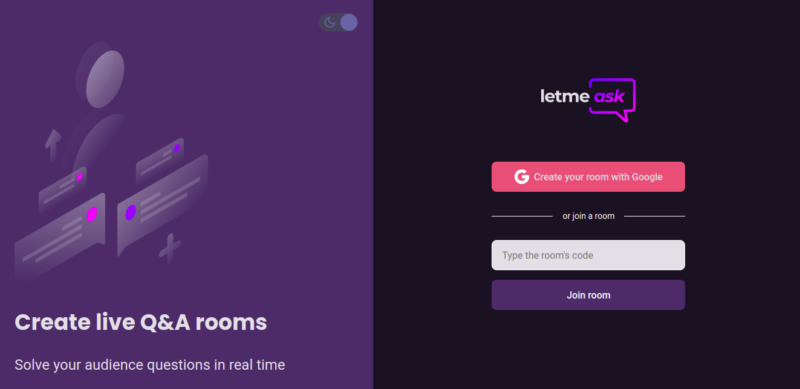
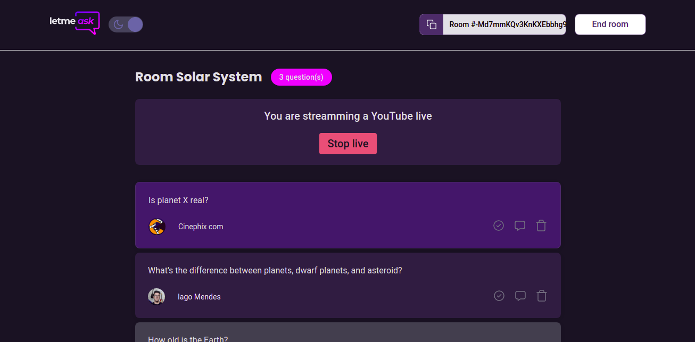
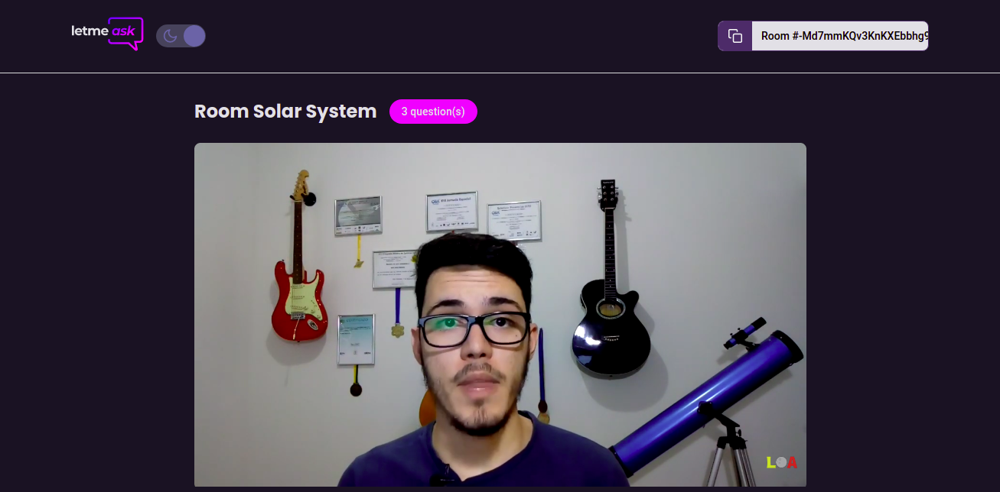
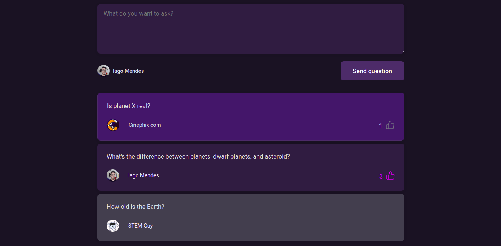

# Letmeask | NLW Together

This is a live Q&A platform, which was developed during the 6th edition of the **Next Level Week**, referred to as **NLW Together**.

This coding event was organized by [Rocketseat](https://rocketseat.com.br). The website is available at [letmeask.iago-mendes.me](https://letmeask.iago-mendes.me).

## Images

## Features developed in the event

- Create a live Q&A room with a Google account
- Users in the room can make and like questions
- Admin can control questions and end the room

## Extra features

- Stream a YouTube live to users in the room
- I18n (internationalization) with English and Portuguese
- Theme switcher (dark or light)
- Secured routes
- Modals for alerts and simple forms
- Sort questions by relevance (highlight, like count, and answered)
- Responsive website

## Technologies

- [JavaScript](https://www.javascript.com)
- [TypeScript](https://www.typescriptlang.org)
- [React.js](https://reactjs.org)
- [Sass](https://sass-lang.com)
- [Firebase](https://firebase.google.com)
- [Lingui](https://lingui.js.org)
